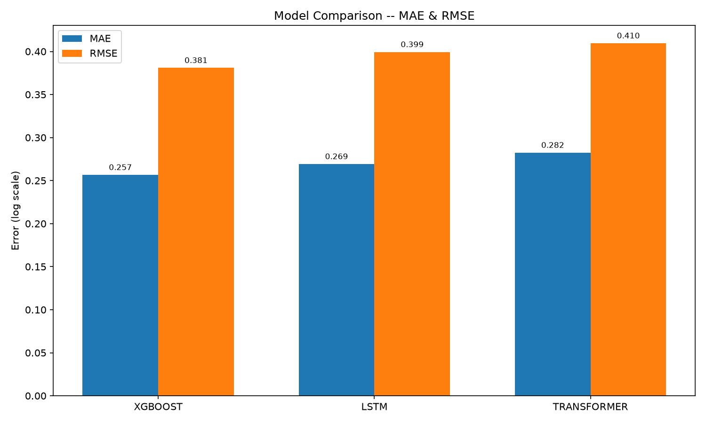

**English** | [中文](README.zh-CN.md)

<div align="center">

# Foresight

**Multivariate Time Series Forecasting**

*LSTM · Transformer · XGBoost · Leakage Prevention*


<a href="https://github.com/MeaFew/foresight/actions"></a>

</div>

---

## Headline

> **XGBoost wins: MAE = 0.257 and RMSE = 0.381 in log1p space.** The useful negative result is that LSTM and Transformer do not beat the gradient-boosted baseline on this structured forecasting task after leakage fixes.

The pipeline systematically benchmarks XGBoost, Prophet, LSTM, and Transformer on tabular retail time-series data with heavy feature engineering (40+ lag / rolling / holiday / oil-price features). Once hand-crafted features cover the long-range dependencies, gradient boosting exploits those structured features more efficiently — deep learning does not necessarily beat a well-built baseline, which is itself a valuable engineering finding.

| Model | MAE ↓ | RMSE ↓ | MAPE ↓ | sMAPE |
|-------|------:|-------:|-------:|------:|
| **XGBoost** | **0.257** | **0.381** | **12.02%** | 39.47% |
| LSTM | 0.269 | 0.399 | 12.71% | 40.66% |
| Transformer | 0.282 | 0.410 | 12.76% | 40.61% |

<p align="center">
  
</p>

The rerun fixes three leakage paths: oil lags are computed on the date-unique series, missing oil values use causal filling, and deep-learning validation targets are restricted to the holdout window. The contract is covered by `tests/test_pipeline.py::TestLeakagePrevention`; metrics come from `reports/model_results.json`.

## Overview

End-to-end pipeline for multivariate time series forecasting. Benchmarks classical methods (XGBoost, Prophet) against modern neural architectures (LSTM, Transformer) on the Kaggle Store Sales dataset.

## Key Highlights

- **Baseline Models**: XGBoost Regressor + Facebook Prophet for benchmarking
- **Deep Learning**: LSTM with embedding layers + Transformer with multi-head self-attention and positional encoding
- **Feature Engineering**: Lag features (1/7/14/28/364d), rolling statistics, cyclical seasonal encodings, promo aggregates
- **Evaluation**: MAE, RMSE, MAPE, sMAPE across all models
- **Delivery**: Streamlit dashboard comparing forecast vs. actual

## Leakage Prevention

Leakage systematically inflates time-series metrics. This pipeline fixes three leakage paths:

- **Oil lag computed on the daily series**: an early version applied `shift(1)` directly on the long table, which crossed (store, family) group boundaries. The lag is now computed on a date-unique frame and merged back, so `oil_lag_1` is always the previous day's oil price.
- **Causal filling of missing oil prices**: `interpolate(method="linear")` is bidirectional (it could pull future oil prices into the validation window); it has been replaced with `ffill().bfill()` only, so a given day's oil price never comes from later observations.
- **DL validation-target filtering**: `TimeSeriesDataset(min_target_date=val_start)` only emits samples whose prediction target is ≥ val_start. The 28 days of training tail ahead of the validation window serve as window input only — never as prediction targets mixed into validation loss/MAE.

## Architecture

```
Raw CSVs (train, stores, oil, holidays, transactions)
    |
    v
Preprocess ──> Date features, log-transform, external merges
    |
    v
Feature Eng ──> Lags, rolling mean/std, seasonal encoding, promo features
    |
    +---> XGBoost / Prophet (baselines)
    +---> LSTM + Embeddings (deep learning)
    +---> Transformer + Positional Encoding (deep learning)
    |
    v
Evaluate ──> MAE, RMSE, MAPE, sMAPE, residual analysis
    |
    v
Dashboard ──> Forecast comparison, error distribution, residual analysis
```

## Tech Stack

| Layer | Tools | Notes |
|-------|-------|-------|
| ETL | pandas, numpy | Time-based train/val split (no random shuffle) |
| Feature Eng | pandas rolling, sklearn preprocessing | Lag/rolling features with shift(1) to prevent leakage |
| Baselines | XGBoost, Prophet | Additive regression + tree-based benchmark |
| Deep Learning | PyTorch, PyTorch Lightning | LSTM + Transformer with categorical embeddings |
| Evaluation | sklearn metrics | MAE, RMSE, MAPE, sMAPE |
| Delivery | Streamlit | Side-by-side forecast comparison |
| Quality | pytest, ruff, GitHub Actions | CI validates pipeline end-to-end |

## Quick Start

```bash
git clone https://github.com/MeaFew/foresight.git
cd foresight

# Create and activate a Python 3.11 virtual environment
python -m venv .venv
# Linux / macOS: source .venv/bin/activate
# Windows PowerShell: .venv\Scripts\Activate.ps1

# Install dependencies, the package, and development tools
make setup
# Windows without GNU Make: python -m pip install -r requirements.txt
#                           python -m pip install -e ".[dev]"

# Download real dataset (GitHub Releases, ~21MB)
bash download_data.sh

# Run full pipeline
python run_all.py

# Or step by step
make preprocess
make features
make train-baseline     # XGBoost + Prophet
make train-lstm         # LSTM model
make train-transformer  # Transformer model
make evaluate

# Launch dashboard
make dashboard

# Quality gates
make verify
```

## Project Structure

```
.
├── src/foresight/
│   ├── generate_mock_data.py     # Synthetic retail sales data
│   ├── preprocess.py              # Date parsing, log-transform, external merges
│   ├── config.py                  # Project-wide paths and modeling constants
│   ├── feature_engineering.py     # Lags, rolling stats, seasonal encoding
│   ├── train_baseline.py          # XGBoost + Prophet
│   ├── train_lstm.py              # LSTM with PyTorch Lightning
│   ├── train_transformer.py       # Transformer with positional encoding
│   ├── train_common.py            # Shared DL training/eval plumbing (Lightning)
│   ├── evaluate.py                # Model comparison & residual analysis
│   ├── predict.py                 # Model loading and inference
│   ├── metrics.py                 # MAE/RMSE/MAPE/sMAPE, TimeSeriesDataset
│   ├── metrics_utils.py           # torch-free mape/smape (lightweight testability)
│   └── audit_consistency.py       # Cross-reference README claims vs outputs
├── dashboard/
│   └── app.py                     # Streamlit forecast comparison
├── tests/
│   ├── test_core.py               # Core-module unit tests
│   ├── test_pipeline.py           # Unit + integration tests
│   ├── test_metrics.py            # mape/smape numerical contract + TimeSeriesDataset consistency
│   └── test_audit_consistency.py  # README/artifact consistency audit tests
├── Makefile                       # Workflow orchestration
└── requirements.txt
```

## Model Comparison

### Evaluation protocol

Kaggle scores original-scale sales with RMSLE, while this repository currently reports MAE, RMSE, MAPE, and sMAPE in log1p(sales) space. These protocols are not directly comparable, so this README shows only local results backed by `reports/model_results.json` on the shared chronological holdout; unsupported RMSLE and leaderboard estimates have been removed.

### Results

| Model | MAE | RMSE | MAPE | sMAPE | Dataset |
|-------|-----|------|------|--------|---------|
| XGBoost | **0.257** | **0.381** | **12.02%** | 39.47% | Full processed training set, final 16-day holdout |
| Prophet (aggregated) | — | — | — | — | *(requires pystan compilation toolchain; verified in Docker/Linux CI)* |
| LSTM | 0.269 | 0.399 | 12.71% | 40.66% | Same chronological holdout |
| Transformer | 0.282 | 0.410 | 12.76% | 40.61% | Same chronological holdout |

> **LSTM/Transformer metrics** are actual full-dataset results produced by PyTorch Lightning training on the same validation window as XGBoost. Run `make train-lstm` and `make train-transformer` to regenerate them; metrics are written to `reports/model_results.json` under `"lstm_results"` / `"transformer_results"` keys. The XGBoost MAE in this table is cross-checked against `reports/model_results.json` by `python -m foresight.audit_consistency` (`make audit`).

> All MAE/RMSE/MAPE values are computed in log1p(sales) space. Every model — XGBoost included — is evaluated on the same chronological 16-day holdout at the tail of the training series (no shuffle, no cross-validation).

<details>
<summary><b>📊 Detailed experiment notes (training speed, improvement ideas)</b></summary>

### Training speed (2.3M samples / RTX 4060)

An early single-threaded DataLoader (`num_workers=0`) left the GPU waiting between steps and was the main reason DL training was slow. With multi-process data loading enabled, per-epoch time dropped significantly:

| Optimization | Notes |
|--------------|-------|
| `num_workers=4 + persistent_workers` | 4 processes run `__getitem__` in parallel; workers are spawned once and reused across epochs |
| `prefetch_factor=4` | Prefetch queue keeps the GPU fed |
| `pin_memory + non_blocking` | Host→device copies overlap with compute |
| `cudnn.benchmark=True` | Auto-selects the fastest kernel for the fixed 28-step windows |
| `bf16-mixed` precision | Ada Tensor Core acceleration |
| `batch_size=1024` | Cuts kernel-launch overhead (bs=128: 72s/epoch → bs=1024: 38s/epoch) |

> Tune via CLI: `python -m foresight.train_lstm --num_workers 8 --batch_size 2048`. If a long run is interrupted, `--resume` continues from the latest checkpoint in `reports/checkpoints/`.

### Why DL did not win, and improvement ideas

LSTM comes close to XGBoost (MAE gap 0.012); Transformer lags slightly. Improvement ideas: longer training, a larger `d_model`, or dedicated time-series architectures such as N-BEATS / TFT.

</details>

## Data

The project uses the **Kaggle Store Sales - Time Series Forecasting** dataset:
- 54 stores across Ecuador
- 33 product families
- Daily sales from 2013 to 2017
- External variables: oil prices, holidays, promotions

For local testing without Kaggle credentials, run `python -m foresight.generate_mock_data` to create a statistically similar synthetic dataset.

## Related Projects

| Project | Repo | Description |
|---------|------|-------------|
| E-commerce User Analytics | [MeaFew/shoplytics](https://github.com/MeaFew/shoplytics) | 29M real user behavior records, 10 analytical modules |
| Marketing Attribution & MMM | [MeaFew/attributor](https://github.com/MeaFew/attributor) | MMM + multi-touch attribution + budget optimization |
| Credit Risk Scoring | [MeaFew/riskscore](https://github.com/MeaFew/riskscore) | WOE/IV + XGBoost/LightGBM + SHAP interpretability |
| GNN Fraud Detection | [MeaFew/graphguard](https://github.com/MeaFew/graphguard) | GraphSAGE + GNNExplainer on graph-structured fraud data |

## License

MIT
